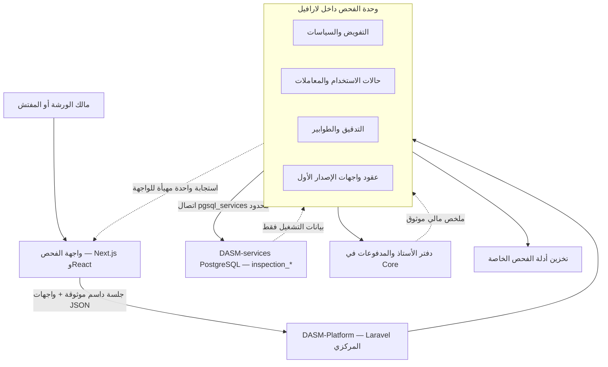
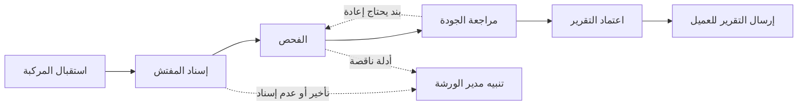

# احتراف منصة الفحص وربطها بلارافيل المركزي

**الحالة:** قرار معماري معتمد وتنفيذ مرحلي جارٍ

**التاريخ:** 2026-07-15

**النطاق:** لوحة صاحب الورشة ومسار نقل منطق الخادم إلى `DASM-Platform`
**حالة البيانات:** المنصة تحت التطوير والحسابات والبيانات الحالية تجريبية

## 1. الحكم التنفيذي

منصة الفحص الحالية ليست تطبيق Vite في الإنتاج. المنتج الفعلي مبني على Next.js وReact وTypeScript، بينما نموذج Vite القديم محفوظ تحت `legacy/vite-prototype` فقط.

المشكلة ليست React بحد ذاته، بل اجتماع ثلاثة أمور:

1. منطق المصادقة والتفويض وقراءة البيانات موزع داخل تطبيق الواجهة.
2. التنقل بين الصفحات يعيد تنفيذ استعلامات وتحققات متكررة.
3. لوحة الورشة تعرض مؤشرات تاريخية وبطاقات متساوية بدلاً من إدارة طابور العمل الحالي.

القرار المعتمد هو **لارافيل المركزي خلفيةً واحدة، وقاعدة خدمات مستقلة، وNext.js واجهةً تشغيلية**.



## 2. لماذا لا نعيد كتابة الواجهة كاملة؟

محطة المفتش تحتاج تصويراً، وقوائم فحص كبيرة، وحفظاً تلقائياً، ودعماً للأجهزة اللوحية والعمل عند ضعف الشبكة. React مناسب لهذه المتطلبات. إعادة كتابة كل الصفحات بقوالب Blade لن تضمن السرعة، وستفقد شيفرة عاملة دون أن تعالج ترتيب سير العمل.

يُحتفظ بواجهة Next.js، لكن دورها ينحصر تدريجياً في:

- العرض والتفاعل.
- إدارة الحالة المرئية والمؤقتة.
- استهلاك عقود لارافيل الموثقة.
- عدم حمل مفتاح خدمة Supabase.
- عدم تقرير صلاحية المستخدم أو ملكية الطلب.

## 3. الوحدة المعمارية في لارافيل

كل العمل الجديد يضاف داخل:

```text
backend/app/Modules/Inspection/
├── Application/
│   ├── Queries/
│   └── Actions/
├── Domain/
├── Http/
│   └── Controllers/
├── Infrastructure/
└── README.md
```

المساحة القديمة `App\Application\Inspection` تعد نقطة تكامل انتقالية. لا يضاف إليها منطق تشغيل جديد، وتُنقل وظائفها تدريجياً إلى الوحدة دون إعادة هيكلة شاملة في دفعة واحدة.

### ملكية البيانات والخدمات

| المجال | المالك |
|---|---|
| الهوية وكلمات المرور والجلسات | داسم الأم |
| التفويض وسياسات الوصول | وحدة الفحص في لارافيل |
| الورش والمفتشون والطلبات والتقارير | قاعدة `DASM-services` |
| الدفع والمحفظة ودفتر الأستاذ | لارافيل المركزي فقط |
| الصور والأدلة التفصيلية | مجال الفحص والتخزين الخاص |
| ملخص التقرير وربطه بالسيارة | داسم الأم عبر عقد متكرر آمن |

## 4. مركز قيادة الورشة

الوظيفة الوحيدة للصفحة الرئيسية هي الإجابة خلال ثوانٍ عن:

- ما المركبات الموجودة داخل التشغيل؟
- ما المتأخر؟
- ما الطلب الذي لم يُسند إلى مفتش؟
- من المفتش المتاح؟
- ما التقرير الذي ينتظر الاعتماد؟
- ما الإجراء التالي لكل مركبة؟



### المكونات المعتمدة

1. شريط قيادة يعرض الحالات التشغيلية لا المؤشرات التسويقية.
2. تنبيهات للتأخير وعدم الإسناد وانتظار الاعتماد.
3. «مسار المركبة الحي» من الاستقبال إلى الاعتماد.
4. جدول كثيف ومقروء للإجراء التالي.
5. حالة الفريق وحمل كل مفتش.
6. استقبال مركبة زائر من الصفحة نفسها.
7. حالة فراغ تشرح الخطوة التالية ولا تعرض مساحة ميتة.

## 5. الهوية البصرية

الاتجاه هو **وحدة تحكم صناعية للفحص** وليس لوحة برمجية مزخرفة.

| الرمز | اللون | الاستخدام |
|---|---|---|
| فولاذ داكن | `#101A29` | القشرة والوضع الداكن |
| سطح عمل | `#F8FAFC` | مساحة القراءة الأساسية |
| أخضر معايرة | `#177A52` | الجاهزية والإجراء التشغيلي الأساسي |
| كهرماني صيانة | `#D97706` | انتظار الإجراء والتنبيه |
| أحمر سلامة | `#B42318` | التأخير والخلل الحرج فقط |
| أزرق رابط | `#1E74E8` | التنقل والروابط الثانوية |

العنصر المميز الوحيد هو «مسار المركبة الحي». لا تستخدم التدرجات الزخرفية أو الرسوم غير المرتبطة بقرار تشغيلي.

## 6. عقد مركز القيادة — الإصدار الأول

المسار:

```http
GET /api/me/inspection-workshop/operations
Authorization: Bearer <DASM session token>
```

خصائص الأمان:

- يتطلب `auth:sanctum`.
- يقبل حساب ورشة فقط.
- يستخرج الورشة من `owner_user_id` للمستخدم المسجل.
- لا يقبل `workshop_id` من العميل، وبالتالي لا يمكن استخدامه لقراءة ورشة أخرى.
- يعيد `401` لغياب الدخول، و`403` لنوع الحساب غير الصحيح، و`404` لعدم وجود ربط، و`503` لفشل مصدر البيانات.

شكل الاستجابة الأساسي:

```json
{
  "success": true,
  "data": {
    "workshop": {},
    "summary": {
      "active_requests": 0,
      "unassigned_requests": 0,
      "in_progress": 0,
      "pending_review": 0,
      "overdue": 0,
      "active_inspectors": 0,
      "available_inspectors": 0
    },
    "queue": [],
    "inspectors": [],
    "generated_at": "ISO-8601"
  }
}
```

## 7. خطة الانتقال

### المرحلة الأولى — مركز القيادة والقراءة المركزية

- إنشاء وحدة الفحص في لارافيل.
- إنشاء عقد مركز القيادة واختبارات عزل الورش.
- إعادة تصميم لوحة الورشة.
- تفضيل استجابة لارافيل مع إبقاء مصدر Supabase الحالي احتياطياً أثناء ترتيب النشر فقط.
- إضافة حالات تحميل وقياس الأداء.

### المرحلة الثانية — صندوق عمل الطلبات

- نقل قوائم الطلبات والتصفية والبحث إلى لارافيل.
- فلاتر محفوظة وفرز حسب الموعد والأولوية.
- إلغاء وصول صفحة الطلبات إلى `service_role`.

### المرحلة الثالثة — الكتابات وسير الحالات

- نقل الإسناد وبدء الفحص والإرسال والمراجعة والاعتماد إلى Actions داخل الوحدة.
- كل انتقال داخل معاملة واحدة مع سجل تدقيق.
- مفاتيح تكرار آمن للعمليات الخارجية.

### المرحلة الرابعة — الأدلة والتقارير

- إثبات ملكية الطلب قبل رفع أو تنزيل أو حذف أي مرفق.
- روابط موقعة قصيرة العمر.
- بصمة للملف والتحقق من نوعه وحجمه.
- مراجعة جودة مستقلة وتوقيع الاعتماد.

### المرحلة الخامسة — إغلاق المسار القديم

- إزالة إجراءات الخادم القديمة بعد مطابقة العقود.
- إزالة عميل `service_role` من مسارات الواجهة.
- تحديد مالك وحيد لهجرات جداول `inspection_*`.
- إعادة تهيئة البيانات التجريبية عند الحاجة قبل الإطلاق.

## 8. متطلبات الأداء

| القياس | الهدف |
|---|---:|
| التنقل الدافئ بين صفحات الورشة | أقل من ثانية |
| عرض هيكل الصفحة بعد النقر | أقل من 200 ملي ثانية |
| استجابة مركز القيادة في الحالة الدافئة | أقل من 500 ملي ثانية عند الخادم |
| استعلامات مركز القيادة | استجابة مجمعة واحدة للواجهة |

لا تعتبر حالة التحميل بديلاً عن تحسين الخادم؛ هي تمنع إحساس التجمّد فقط.

## 9. بوابة الأمان قبل الإطلاق

- اختبار مالك ورشة لا يرى ورشة ثانية.
- اختبار المفتش لا يرى إلا المسند إليه.
- اختبار العميل لا يرى إلا طلباته وتقاريره المعتمدة.
- إغلاق المسار عند غياب إعدادات التحقق.
- كوكيز جلسة آمنة وغير قابلة للقراءة من JavaScript حيث يسمح عقد الدخول.
- عدم استخدام `user_metadata` للتفويض.
- عدم وجود مفتاح خدمة في حزمة المتصفح.
- معاملات كاملة لانتقالات الحالة.
- صندوق أحداث قابل لإعادة المحاولة لمزامنة التقرير والمال.
- سجل تدقيق يحمل المستخدم والورشة والطلب والتغيير.

## 10. معايير قبول الإصدار الأول

- تعرض لوحة الورشة طابور التشغيل والإجراء التالي دون أرقام وهمية.
- يظهر التأخير وعدم الإسناد وانتظار الاعتماد بوضوح.
- تظهر حالة المفتش وحمله الحالي.
- يعمل العرض على الحاسوب والجهاز اللوحي والجوال.
- يُفضّل عقد لارافيل المركزي عند توفره.
- يبقى المصدر القديم احتياطياً خلال النشر المرحلي فقط.
- تنجح اختبارات المصادقة ونوع الحساب والعزل بين ورشتين.
- تقاس سرعة التنقل بالحساب التجريبي بعد النشر.

## 11. ما لا يشمله الإصدار الأول

- تشغيل هجرات على قاعدة الإنتاج.
- نقل كل إجراءات الفحص دفعة واحدة.
- إعادة كتابة الواجهة بقوالب Blade.
- إنشاء نظام هوية أو كلمات مرور للفحص.
- إدخال بيانات تشغيل وهمية وعرضها بوصفها حقيقية.
- تعديل المحفظة أو دفتر الأستاذ أو التسويات.
